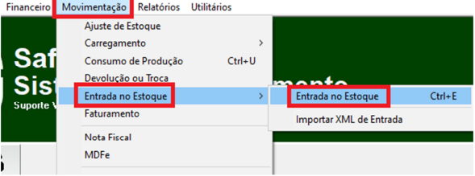

# Entrada Manual com XML Fiscal e Real

* Abra a tela de “Entrada no Estoque”.

<figure><figcaption></figcaption></figure>

* Preencha os campos abaixo:

<figure><figcaption></figcaption></figure>

1. Digite os 44 números da chave de acesso, e aperte ENTER(para preencher alguns campos automaticamente).
2. Preencha o CFOP de entrada(caso não saiba qual usar pergunte a sua contabilidade).
3. Preencha o campo “A Vista”.
4. Deixe **DESMARCADA** o campo de “Entrada Para Balanço”, pois quando marcada a entrada é feita somente no estoque real.
5. Escolha o fornecedor da nota.
6. Se não tiver mais de um almoxarifado a opção 8 não aparecerá. Mas se houver mais de um então escolha o almoxarifado.

* Caso precise modificar o Valor Total da Nota pode preencher os campo abaixo. Dos campos marcados o “Desconto” é o único que diminui o valor total.

<figure><figcaption></figcaption></figure>

Agora clique no botão “Incluir Produtos” para inserir as mercadorias.

<figure><figcaption></figcaption></figure>

Informe o produto com suas informações(o campo “Data Validade” é opcional). E clique no botão **INCLUIR**, e vá acrescentando os produtos um por um.

<figure><figcaption></figcaption></figure>

1. Quando essa opção fica marcada, o valor de custo no cadastro do produto passa a ser o mesmo dessa entrada.
2. Quando marcada essa opção, o sistema calcula o custo médio dessa entrada com o estoque atual(essa opção 2 raramente é utilizada pelas empresas).

Após incluir todos os produtos Clique em **SALVAR.**

<figure><figcaption></figcaption></figure>

